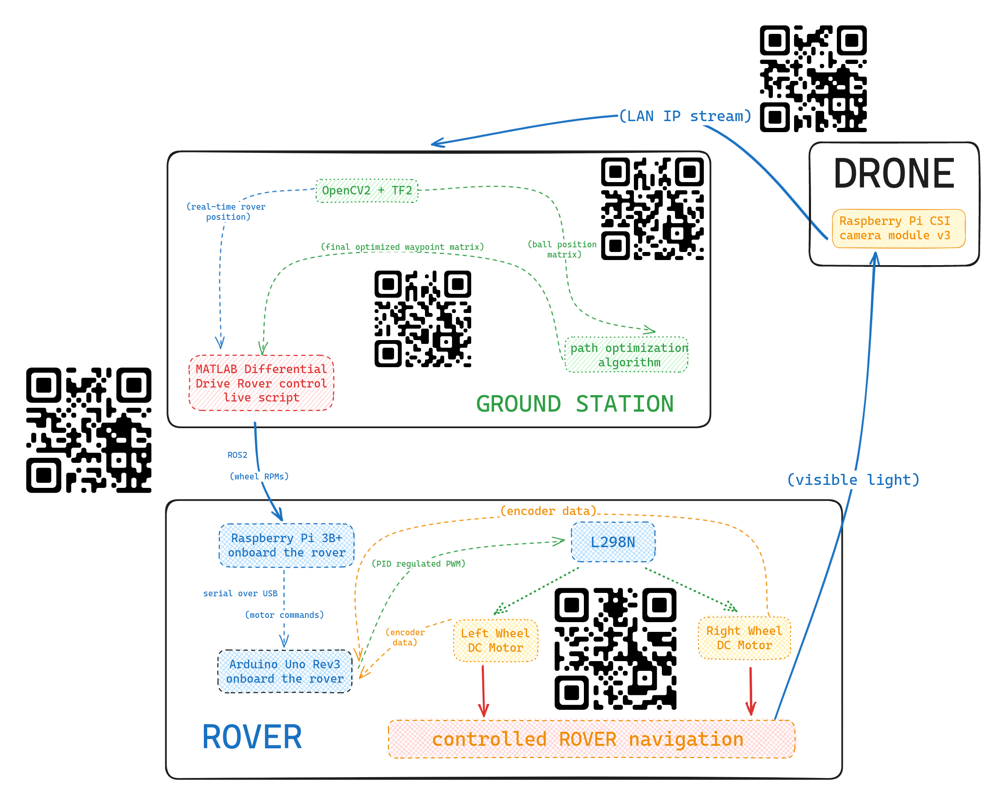

# DRONEacharyaITSP2023

## Control Flow diagram of mission execution

## Getting the image
1. We set up an local `http` server on the Raspberry Pi onboard the drone to host the live camera IP stream from it using [this](https://github.com/ayufan/camera-streamer/tree/main) and demonstrated it [here](https://youtu.be/Rc5d5Zrg0gI)
2. We used an `http` request in the code to get the image from the server. This can be done using the requests module in Python as shown [here](https://www.w3schools.com/python/ref_requests_response.asp).
4. We downloaded the content of the response object as an image file and fed that to the algorithm. The reference for downloading is [here](https://www.geeksforgeeks.org/downloading-files-web-using-python).

## Computer Vision
code located [here](code/machine-vision/) and [here](code/ArUco-pose/)

### Object Detection
Training a custom object detection model is a tedious and time consuming task. Hence we used pretrained models which were trained on a popular dataset known as Coco dataset. It contains 92 items, including a sports ball which was useful to us. I referred to the following video for our initial algorithm: [tutorial](https://www.youtube.com/watch?v=hVavSe60M3g&t=154s). The model can be downloaded here: [model link](https://github.com/haroonshakeel/real_time_object_detection_cpu). This is a CNN model known as SSD Mobilenet v3. It works fairly well with distinct recognisable objects, but our images were to be taken from a significant height, so the balls appeared little more than white discs. Hence, I had to think of a lot of workarounds to make it detect the balls properly. I did the following modifications to the algorithm:
1. I manipulated the pixels of the image such that the balls became black, and everything else became white, so there would be better contrast. When working with OpenCV, an image is stored as an array of RGB values for each pixel. I iterated through all the pixels and wrote a condition such that all the white pixels would turn black and all colours would turn black.
2. I turned down the confidence level so that it would report even low confidence detection.
3. I restricted it to report only balls and ignore all other detected objects.
4. The model was detecting the same ball multiple times, so I put in place a condition that a ball would only be detected if it was not within a specific radius of any other ball which was already detected.
5. I put in place a condition that only balls of a specific size would be reported, as it was detecting even dots as balls. Even after all these modifications, the model was not very reliable. It was giving me some false positives and false negatives.
Hence, I searched for a different model. I found this excellent tutorial which enabled me to test out several models with the same code to find out which one worked best for our purpose: [tutorial](https://www.youtube.com/watch?v=2yQqg_mXuPQ).
Different models behave differently with different kinds of images, so it is best to try out several before settling on one. The above video gives a generic code which works with any of the models in the [TensorFlow Object Detection Zoo](https://github.com/tensorflow/models/blob/master/research/object_detection/g3doc/tf2_detection_zoo.md). TensorFlow is a machine learning library which was used to create all these models. TensorFlow can be installed [here](https://www.tensorflow.org/install/pip). The installation requires Anaconda, which can be installed [here](https:/www.anaconda.com/download).
I used the CenterNet HourGlass104 512x512 model from the TensorFlow zoo. I still had to apply modifications 1, 2, and 3 but did not need to apply the others, and the model was much more reliable in detecting the balls in different kinds of environments. The only requirement was that the background wasn't too close to white. It came with a catch that it took quite long to load and was not feasible to load it for every single image; I bypassed this with the following modifications:
1. I created a simple text file named bool, which contained only the words 'True' or 'False'. 
2. After loading the model, the code goes into an infinite loop. It checks the contents of the bool file, and if the file contains 'True', it accepts an image from the drone, and processes it to return a .csv file of coordinates. It then overwrites the 'True' in the bool file with 'False' and the loop continues. If the file already contains 'False', it does nothing for that iteration of the loop. 
3. The above model was running continuously on a terminal in the background.
4. When we wanted an image processed, we ran another code. This code had only one job: to overwrite the 'False' in the bool file to 'True'.

### Getting Coordinates
#### ArUco Markers
1. For the localisation part we used the aid of ArUco markers which are markers having a specific ID that can be spotted via the camera. There exists an extensive codebase for the detection and estimation of ArUco markers present on OpenCV's website.
2. The pose estimation of ArUco markers can be done via the basic trigonometric concepts but one thing that one needs to take care about are the linear and angular deviations that may be present in the image captured by the cam. For this we calibrate the camera by getting the camera matrix and distortion matrix which via matrix multiplication give the exact position of the marker. 
#### Golf Balls
1. We constructed a grid over the whole golf field and took images cell by cell.
2. We marked the corners of the cells using ArUco markers. OpenCV has a library for ArUco markers which makes their detection much easier. Care must be taken to ensure that we are consistent with the type of ArUco we use, and the entire marker must be visible for it to be detected. 
3. We got the coordinates of the balls in terms of pixels from the bounding boxes which we got from the object detection algorithm. We subtracted the coordinates of the bottom left ArUco(considered origin of the cell) from these coordinates to get the coordinates of the balls with respect to the origin of the cell.
4. We got the length of the ArUco marker in pixels, and hard-coded a value for its length in meters.
5. Using the length of the ArUco in meters and in pixels, we found the scaling factor to multiply with the coordinates of the balls to get their coordinates in meters.
6. We also transformed the coordinates of the balls to account for slight rotation of the cell in our image, using basic vector concepts.
7. A demonstration of the above can be found in this [video](https://youtu.be/3zrhTF3uPxY).
#### Rover ArUco
1. We obtain the live position of the ArUco marker atop the rover (and by proxy the rover) using similar technique to that stated above.
2. The same is obtained multiple times every second and published onto a ROS2 topic to which the ground station MATLAB instance is subscribed.
### Shift of Origin
1. All ArUcos have a numerical ID. We can get ArUcos with specific IDs if we want. In this case, we got ArUcos numbered sequentially from 1. We then used these in numerical order as origins for the cells of our grid.
2. This way, we were able to find out which cell a particular image belonged to.
3. We used the information about row and column of the cell derived from its ArUco ID to work out what to add to a ball's coordinates to get its coordinates with respect to the overall origin of the grid.
4. We got the length of a single cell by calculating the distance between 2 corner ArUcos.
5. This way, we got the coordinates of all the balls with respect to the overall origin of the grid.
6. We fed these coordinates to the rover algorithm after sorting them to get an optimal path for each cell.

## Path Planning
For the path planning algorithm I looked into the classic travelling salesman problem. So the main goal of the TSP is to traverse all the points in a graph with the least distance possible. TSP is an NP-hard problem so in the case of a normal graph with n vertices the Hamilton cycles amount to $\frac{n(n-1)!}{2}$. I used a very basic algorithm with $O(n^{2})$ time complexity where I checked the distance of each node from the current node and went to the node which is at the least distance and omitted the previous node thus omitting the chance of an infinite loop. Further I tried to implement the Lin-Kernighan algorithm but as it turns out the data that we were handling were quite small and hence the clustering approach was not a viable one.

code located [here](code/path-planning)

## Rover Control
Control of the rover that is robust to perturbations rover was established through a MATLAB live script that reads a (2-D) waypoint matrix from a .csv file and sets up all the required closed loop control algorithms to generate control inputs to navigate a Differential Drive Rover to each waypoint in which they're present in the matrix, and then publish them to ROS2 as a publisher to a topic. A ROS2 node running on the ground station publishes the live detected position of the rover (by running ArUco detection on a live stream from a camera facing downwards on the field). This live position of the rover is then fed to a `controllerPurePursuit` object to generate the immediate trajectory of the rover in real time and the `differentialDriveKinematics` class in MATLAB to then convert the trajectory into inputs for our rover. The computed control commands are used to drive the simulated robot along the desired trajectory to navigate the waypoints, as well as published to a topic on a local ROS2 network to which a RPi 3B+ onboard the rover is connected and subscribed. This has been demonstrated in this [video](https://youtu.be/xOPCUW9RekQ). It is then interfaced with an Arduino Uno Rev3 through a wired serial USB connection to accomplish accurate control on the RPM of the encoder DC motors. This has been demonstrated in this [video](https://youtu.be/Uj8uw9Ly6Q8).

MATLAB code located [here](code/matlabROS2ctrl).

Arduino code located [here](code/ROSArduinoBridge/)
